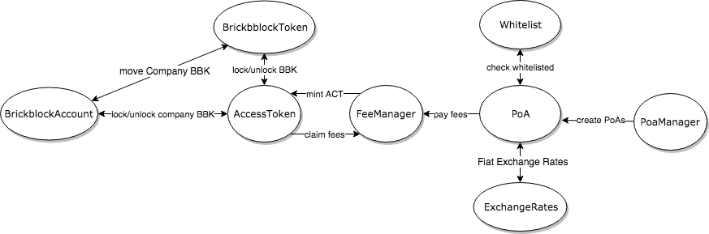

# Brickblock Technical Whitepaper
by Marius Hanne, Jakob Drzazga, Adrian Kizlauskas, Philip Paetz, Martin Mischke

### Abstract
This document describes a smart contract platform built on top of the globally distributed
computing network known as [Ethereum](https://ethereum.org/).
The suggested Proof-of-Asset (PoA) scheme will enable users to seamlessly trade tokens,
which represent different types of Foreign-Asset on all [ERC20](https://theethereum.wiki/w/index.php/ERC20_Token_Standard) compatible markets.

The basic idea is to create a number of PoA contracts, each representing a different foreign asset.
By linking the token contract to a digital trust fund DTF, there will be a near 1:1 coupling between
the value of the token and the foreign asset.

Users can purchase PoA-Token in exchange for ether, trade them,
or hold them and receive a share of any dividends that the asset pays out.

## 1. Overview
During a contribution period, Brickblock tokens (BBK) will be distributed among participating contributors.
Brickblock tokens can be traded on any market, or locked up in order to generate so called access tokens (ACT).
Access tokens are minted and distributed to lockedBBK holders whenever a fee is paid in the Brickblock ecosystem; they are burnt in order to claim a proportional amount of ether.
Proof-of-Asset tokens represent a certain foreign asset available to trade on the Brickblock platform.
The assets backing those tokens are held by a publicly auditable digital trust fund.
All these tokens implement the ERC20 specification and are seamlessly tradable on compatible third-party markets.

*Figure 1: The different types of tokens, and how they interact*
